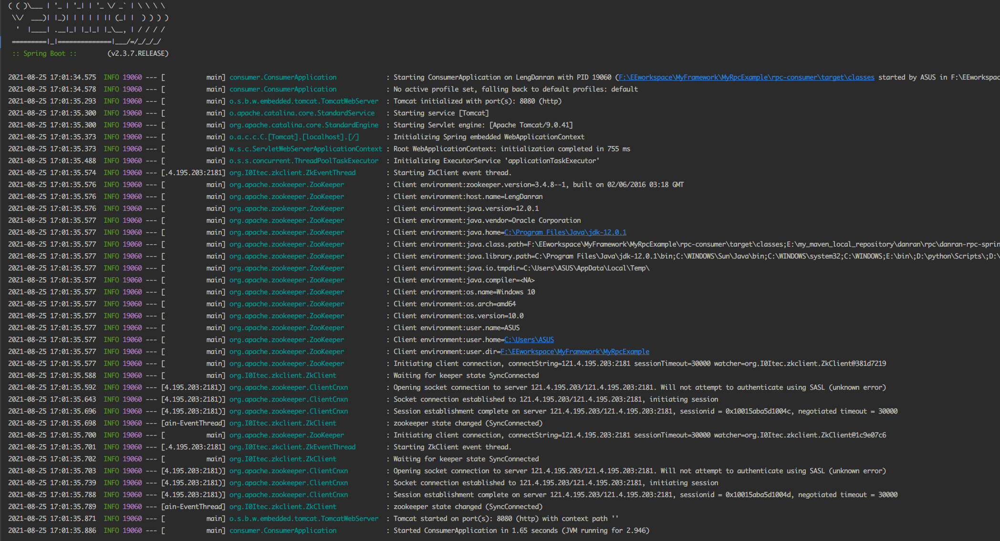
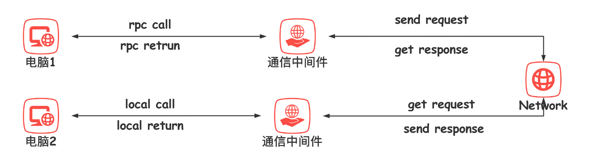
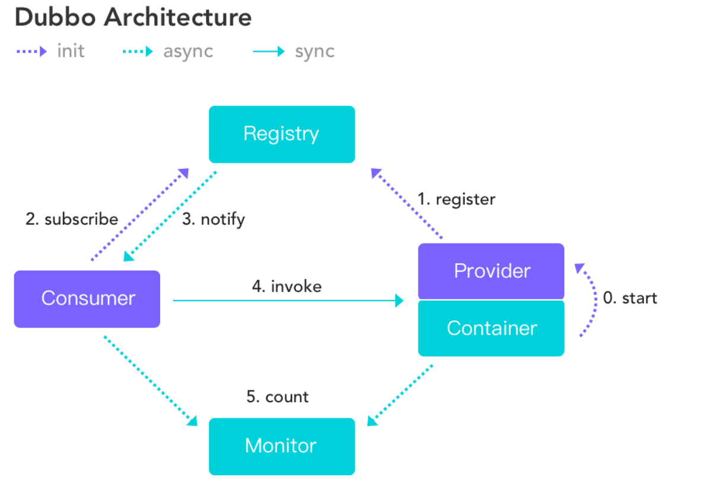
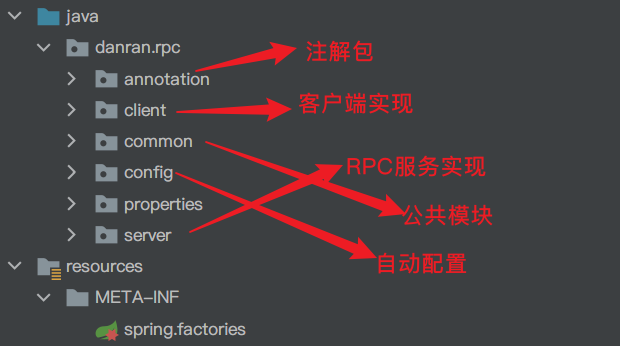
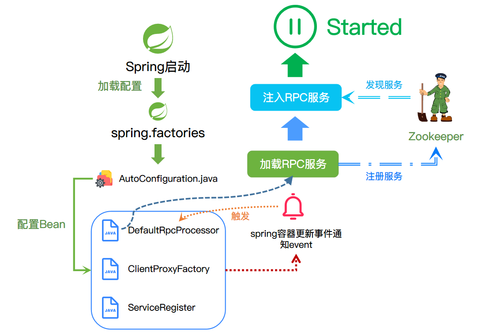
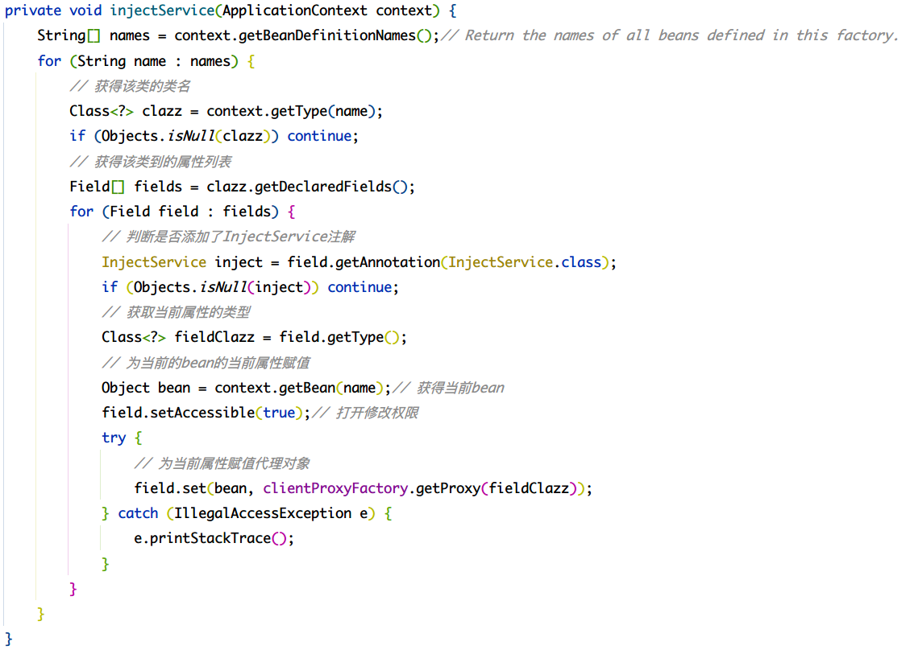

# Java基于Netty/Zookeeper实现的RPC框架

> 基于Spring Boot Starter的小型RPC框架。编写这个RPC框架并不是为了重复造轮子，而是出于学习的目的，通过手写一款RPC框架来达到知识的学习和应用目的。简易的`RPC`框架(`danran-rpc`)，底层使用`Netty`进行网络通信，使用`Zookeeper`为注册中心。该项目可以Maven打包直接加入其他项目运行。另外一个仓库：
>
> - `https://gitee.com/lengdanran/danran-rpc-debug`
> - `https://github.com/lengdanran/danran-rpc-debug`
>
> 为该项目的整合调试仓库，在里面可调试`danran-rpc`的源码

## 快速上手

> 示例代码：https://gitee.com/lengdanran/danran-rpc-example

- `https://gitee.com/lengdanran/danran-rpc.git`
- `https://github.com/lengdanran/danran-rpc.git`

###  生成本地Maven依赖包

从以上的git仓库地址clone代码到本地，然后进入到项目pom目录中，执行maven安装命令：

``` shell
mvn clean install
```

### 服务提供者-消费者同时引入该maven依赖

引入打包安装好的maven依赖，因为该RPC框架内部使用了和Springboot本身冲突的日志框架，引入依赖时，最好将`danran-rpc`的日志依赖移除，避免程序无法启动。


``` xml
<dependency>
    <groupId>danran.rpc</groupId>
    <artifactId>danran-rpc-spring-boot-starter</artifactId>
    <version>1.0.1</version>
    <!--排除日志冲突-->
    <exclusions>
        <exclusion>
            <groupId>log4j</groupId>
            <artifactId>log4j</artifactId>
        </exclusion>
        <exclusion>
            <groupId>org.slf4j</groupId>
            <artifactId>slf4j-log4j12</artifactId>
        </exclusion>
    </exclusions>
</dependency>
```

### 服务提供者、消费者同时配置注册中心(请更换为自己的ZK地址)

在项目的`application.properties`添加如下配置

``` properties
danran.rpc.register-address=121.4.195.203:2181 # zk的地址
danran.rpc.protocol=danran
danran.rpc.server-port=6666
```

### 服务提供者使用示例

``` java
package provider.service;

import common.api.BookService;
import common.entity.Book;
import danran.rpc.annotation.RPCService;
import org.springframework.beans.factory.annotation.Autowired;
import provider.mapper.BookMapper;

import java.util.List;

/**
 * @Classname BookServiceImpl
 * @Description TODO
 * @Date 2021/8/24 15:50
 * @Created by ASUS
 */
@RPCService
public class BookServiceImpl implements BookService {

    @Autowired
    private BookMapper bookMapper;

    /**
     * @return 所有的书籍信息
     */
    @Override
    public List<Book> getAllBooks() {
        return bookMapper.getAllBooks();
    }
}
```

在具体的服务实现类上添加`@RPCService`注解，即可将该类作为服务提供者注册到`zookeeper`中，消费端可以发现该服务，添加该注解之后，将会作为Spring的Component注入到Spring的容器中。（不再需要添加@Component注解）

### 服务消费者示例

``` java
package consumer.controller;

import common.api.BookService;
import common.entity.Book;
import danran.rpc.annotation.InjectService;
import org.springframework.web.bind.annotation.GetMapping;
import org.springframework.web.bind.annotation.RequestMapping;
import org.springframework.web.bind.annotation.RestController;

import java.util.List;

/**
 * @Classname ConsumerController
 * @Description TODO
 * @Date 2021/8/24 19:04
 * @Created by ASUS
 */
@RestController
@RequestMapping("/consumer")
public class ConsumerController {

    @InjectService
    private BookService bookService;

    @GetMapping("/get_all_books")
    public List<Book> getAllBooks() {
        return bookService.getAllBooks();
    }
}
```

使用`@InjectService`注解，可以启动服务发现，然后自动注入远程服务的代理对象。

### 示例运行结果

启动两个Springboot的web服务，provider提供查询数据库的具体实现，consumer远程调用该服务。

- provider启动日志


- consumer启动日志



启动postman接口调试工具，访问服务接口：


接口成功返回数据，查看程序日志：


## RPC原理

### 定义

RPC(Remote procedure call)远程过程调用，简单理解是本地需要某个服务，而具体的服务由另外一个独立的服务端提供，我们可以通过网络等其他方式通知到服务端执行对应的服务，然后返回我们关心的信息。

> RPC:打电话查成绩
>
> 本地：你
>
> 远端服务：你孩子的班主任
>
> 现在你想了解孩子的期末考试成绩，而成绩在班主任那里，此时你便打电话给班主任，然后班主任查询，告诉你孩子的成绩是多少，这就是一个RPC过程。



电脑1想要调用电脑2中的某个服务，会发出一个RPC call给通信中间件，通信中间件将请求编组后通过网络将请求发送到电脑2端的通信中间件，通信中间件从网络中读取请求数据包，解组，然后在电脑2内部发起本地调用，调用结束之后，会得到一个返回数据，通信中间件再将响应数据编组通过网络发送到电脑1。

>  此时会有一个问题：电脑1（消费端）如何知道远程服务的地址?

### 服务发现

解决这个问题，可以采用第三方，即是这个人专门来管理服务，一旦有服务请求来，就告诉对方你所请求的服务的地址有哪些。

因此，目前比较流行的RPC框架Dubbo采用的是如下的架构：



主要有消费者，注册中心，提供者三方架构角色，消费者通过注册中心去订阅自己关心的服务，注册中心会将注册了的服务地址等相关信息返回给消费者，消费者再通过具体的协议将数据发送到socket中最后由网卡发送到网络上，最后得到服务提供者的响应数据。

## danran-rpc实现

### 文件结构



- annotation：里面为InjectService和RPCService两个注解的定义，用来注入和发布服务
- client：为客户端服务发现、服务代理以及网络通信的实现
- common：框架的公共模块，包含协议、序列化以及公用Entity的定义
- config：Spring容器启动时的自动配置类
- properties：用户自定义参数
- server：rpc服务的注册、发布与启动

### 实现组件

danran-rpc的实现是参照着dubbo实现的，主要采用了如下几个组件：

- 网络通信——Netty
- 注册中心——Zookeeper（后续应该会继续实现不同的注册中心：Redis、Nacos、Eureka等）
- 代理——Java动态代理
- IOC——Spring

### 整体架构


### 启动流程




### Client包实现

依据RPC的原理，客户端需要将请求通过网络通信中间件将数据编组发送出去并得到对应的响应数据。

#### NetClient

该接口定义了网络请求客户端，定义网络的请求规范，可以由不同的网络通信框架来实现，用户可以自定义实现类，可以整合到danran-rpc框架中。这里采用Netty实现。

``` java
public byte[] sendRequest(byte[] data, Service service) throws InterruptedException {
    String[] ip_port = service.getAddress().split(":");
    String ip = ip_port[0];
    int port = Integer.parseInt(ip_port[1]);

    SendHandler sendHandler = new SendHandler(data);
    byte[] rsp;
    // 配置客户端
    EventLoopGroup group = new NioEventLoopGroup();
    try {
        Bootstrap bootstrap = new Bootstrap();
        // 初始化通道
        bootstrap.group(group).channel(NioSocketChannel.class).option(ChannelOption.TCP_NODELAY, true).handler(new ChannelInitializer<SocketChannel>() {
            @Override
            protected void initChannel(SocketChannel ch) {
                ChannelPipeline pipeline = ch.pipeline();
                pipeline.addLast(sendHandler);
            }
        });
        // 启动连接
        bootstrap.connect(ip, port).sync();
        rsp = (byte[]) sendHandler.rspData();
        logger.info("Send Request and get the response: {}", rsp);
    } finally {
        // 释放线程组资源
        group.shutdownGracefully();
    }
    return rsp;
}
```

#### ClientProxyFactory

这是客户端代理工厂， 用于创建远程服务的代理类，同时封装了请求和响应数据的编组合解组操作。该工厂类包含了服务发现实例对象以及具体的网络层实现，可以同服务发现实例去发现服务以及发送数据。里面的`getProxy(Class<T> clazz)`方法会返回clazz的代理对象。核心代码为：

``` java
return (T) this.objectCache.computeIfAbsent(
    clazz, 
    cls -> newProxyInstance(
        cls.getClassLoader(), 
        new Class<?>[]{cls}, 
        new ClientInvocationHandler(cls)));
```

该段代码会以该clazz的Class来构建一个代理对象，具体的代理实现为`ClientInvocationHandler`.利用的是JDK的动态代理，实现了InvocationHandler接口。

其中关键为`invoke()`方法的实现。通过反射的方式调用被代理对象的方法。

首先它会先通过被代理对象clazz获得被代理对象的全类名，服务发现实例会以获得的全类名去服务注册中心去发现与之对应的远程服务。

``` java
List<Service> services = serviceDiscovery.getServices(serviceName);
```

`Service`中包含了远程服务的名称、服务协议以及服务地址（ip+端口）获得具体远程服务之后，会生成一个`RequestWrap`请求包装类，会将服务名称，被代理的方法名称，被代理方法的参数类型以及被代理方法的参数封装起来。之后便会根据协议去编组该封装请求得到data，最后通过网络层`NetClient`实现请求发送。最后会从网络层实现那里获取得到响应数据，解组响应得到`ResponseWrap`，从响应封装中得到具体的响应数据。

#### 服务发现——ServiceDiscovery

服务发现会从注册中心查询得到远程服务注册的信息，然后返回，在danran-rpc中，目前是以Zookeeper为注册中心实现的，故具体的实现类为`ZkDiscovery`.以下是服务发现具体实现流程：

> 服务发现的依据和服务注册的依据是完全一致的，确保注册了的服务一定会被发现。

- 根据提供的服务名称(默认是全类名)拼接znode路径
- 从Zookeeper中获得该路径下的所有子节点的名称（子节点的名称即为具体远程服务信息的JSON字符串按照URLEncode之后的字符串）
- 根据拿到的服务提供信息解码得到服务提供者并返回

### Server包实现

该包是对RPC服务注册与服务注入的实现包，内部包括了注册模块`register`和服务启动模块。

#### register模块

该模块提供了一个`ServiceRegister`的顶部接口，用于定义服务注册的规范，用户可以实现该接口，自定义注册规范与逻辑，danran-rpc具体的实现类为`ZookeeperExportServiceRegister`,提供Zookeeper注册中心实现。

##### ZookeeperExportServiceRegister

该类（后续简称ZESR）实现注册接口`ServiceRegister`,提供Zookeeper注册实现。

ZESR会根据用户提供的Zookeeper的地址，开启一个zkClient。

**服务注册——register()**

- 获取服务提供者的host地址
- 用户提供服务端口port，在port向外暴露服务
- 封装服务包装类`Service`
- 调用服务暴露`exportService()`

**服务暴露——exportService()**

- 从Service中获取到服务名称（服务实现接口的全类名）
- 服务地址拼接（和服务发现的逻辑一致）
- 具体的服务（包含服务提供者的服务地址，以及服务实现接口）

> ``` json
> {
>   	"address":"192.168.25.1:6666",
>     "name":"common.api.BookService",
>     "protocol":"danran"
> }
> ```

- 向Zookeeper注册服务——创建节点

``` java
/***
 * 服务暴露
 *
 * @param service 需要暴露的服务
 */
private void exportService(Service service) {
    String serviceName = service.getName();
    String uri = JSON.toJSONString(service);
    try {
        uri = URLEncoder.encode(uri, "UTF-8");
    } catch (UnsupportedEncodingException e) {
        e.printStackTrace();
    }
    // 抽象的服务定位节点
    String servicePath = "/rpc/" + serviceName + "/service";
    logger.info("抽象服务[" + serviceName + "]注册地址 == " + servicePath);

    if (!zkClient.exists(servicePath)) {
        zkClient.createPersistent(servicePath, true);
    }
    // 具体的服务实例地址
    String uriPath = servicePath + "/" + uri;
    logger.info("具体服务实例注册节点 == " + uriPath);

    if (zkClient.exists(uriPath)) zkClient.delete(uriPath);// 如果存在，删除更新
    zkClient.createEphemeral(uriPath);// 创建一个短暂的节点
}
```

#### RPC处理者——DefaultRpcProcessor

该类定义了RPC服务启动的具体流程，实现Spring的ApplicationListener，支持服务启动暴露，自动注入Service。

内部含有三个成员：


该类主要做两件事情：

- 把用户用`@RPCService`标记的服务发布
- 将用户用`@InjectService`标记的服务注入

这里使用了Spring提供的IOC容器，从容器中获取bean进行操作。

##### RPC服务启动

1. 从Spring容器中取出所有用`@RPCService`标记的bean
2. 遍历得到的bean列表，每一个bean是实际服务的提供类对象实例
3. 获得bean的Class对象clazz，并通过clazz去获得他实现的接口（和客户端的接口是一致的，以此来关联起来客户端和服务端）
4. 以父类（接口），实际的服务提供者包装，然后调用服务注册模块，注册到Zookeeper中
5. 启动RPC服务实现


##### 服务注入

将用户用`@InjectService`标记的服务注入。

同样使用Spring的容器，得到容器中的bean，然后判断每个bean是否有需要注入的服务，一旦发现有需要注入的属性，通过反射的方式，将属性注入为代理对象，一旦客户端发起服务调用，便会触发代理对象的invoke()方法，执行代理执行，得到需要的返回数据。



